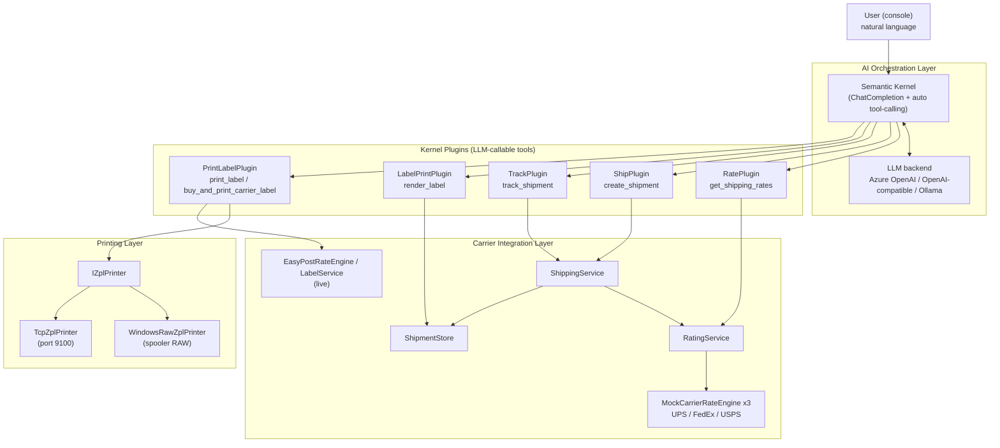
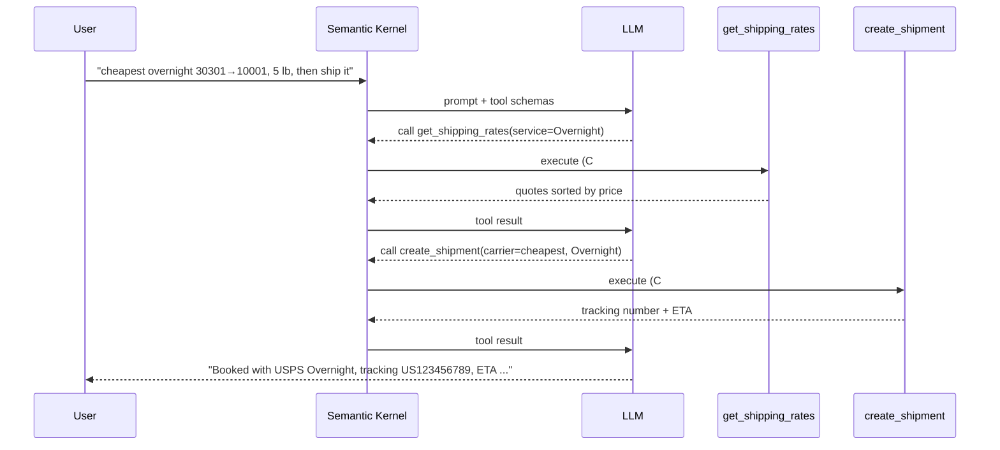

# ShipMate AI — Conversational Multi-Carrier Shipping Copilot

A natural-language shipping assistant built on **.NET 8** and **Microsoft Semantic Kernel**.
Users describe what they want in plain English ("find the cheapest overnight option and
ship it"), and a large language model **autonomously orchestrates** carrier tools — rating,
booking, and tracking — to fulfil the request.

> The AI layer is deliberately decoupled from carrier integration. The LLM handles
> *intent understanding* and *tool orchestration*; the carrier engines do the *real work*
> of rating, shipping, and tracking. Swapping a mock carrier for a live UPS/FedEx/EasyPost
> API requires **no change to the AI layer**.

---

## Highlights

- **LLM Function Calling** — carrier operations are exposed to the model as typed,
  self-describing tools via `[KernelFunction]` + `[Description]` attributes.
- **Multi-step agent orchestration** — a single request can trigger a chain of tool
  calls (rate → ship → track) that the model plans on its own.
- **Cross-tool state** — a tracking number minted by `create_shipment` is resolvable by
  `track_shipment` later in the session.
- **Pluggable LLM backend** — Azure OpenAI, OpenAI, any OpenAI-compatible provider
  (DeepSeek / Qwen / Zhipu), or local **Ollama** — selectable via configuration.
- **Carrier-agnostic abstraction** — `ICarrierRateEngine` mirrors the real
  StarShip `CarrierEngine` rate-transaction dispatch pattern, so production carrier
  integrations drop in cleanly. Ships with both a live **EasyPost** engine and a mock.
- **Tested** — NUnit suite covers rate parsing/de-duplication, ZPL generation, rate
  aggregation, and ZPL printing, running fully offline against captured samples.
- **Real label printing** — sends 4x6 ZPL to a label printer via the Windows print
  spooler (raw) or TCP 9100, and can buy a real carrier label from EasyPost.
- **Secure config** — API keys via .NET user-secrets, never committed to source.

---

## Architecture



### Request flow: "find the cheapest overnight and ship it"



---

## Project layout

```
ShipMate.AI/
├─ ShipMate.AI.slnx
├─ NuGet.config                      # nuget.org only (standalone)
├─ src/ShipMate.AI.Console/
│  ├─ Program.cs                      # host: config, kernel, provider switch, chat loop
│  ├─ appsettings.json                # Provider + backend settings
│  ├─ Carriers/                       # carrier integration layer (swappable)
│  │  ├─ ICarrierRateEngine.cs        # rate-engine contract (mirrors CarrierEngine)
│  │  ├─ MockCarrierRateEngine.cs     # deterministic stand-in rate engine
│  │  ├─ EasyPostRateEngine.cs        # live multi-carrier rates via EasyPost API
│  │  ├─ EasyPostRateParser.cs        # pure JSON→RateQuote mapping (unit tested)
│  │  ├─ RateModels.cs                # RateRequest / RateQuote / ServiceLevel
│  │  ├─ RatingService.cs             # fans rate requests across carriers
│  │  ├─ ShipmentModels.cs            # ShipmentRequest / Result / TrackingInfo
│  │  ├─ ShipmentStore.cs             # in-memory shipment store (Ship↔Track bridge)
│  │  ├─ ShippingService.cs           # create shipment + synthesize tracking
│  │  ├─ EasyPostLabelService.cs      # buy a real carrier label (ZPL) via EasyPost
│  │  ├─ LabelModels.cs               # LabelFormat / LabelResult
│  │  └─ LabelService.cs              # render 4x6 ZPL label from a shipment
│  ├─ Printing/                       # ZPL printer transports
│  │  ├─ IZplPrinter.cs               # printer contract + PrintResult
│  │  ├─ WindowsRawZplPrinter.cs      # raw spooler print via winspool P/Invoke
│  │  ├─ TcpZplPrinter.cs             # network print to host:9100
│  │  └─ NullZplPrinter.cs            # no-op (Null Object) when unconfigured
│  └─ Plugins/                        # Semantic Kernel tools exposed to the LLM
│     ├─ RatePlugin.cs                # get_shipping_rates
│     ├─ ShipPlugin.cs                # create_shipment
│     ├─ TrackPlugin.cs               # track_shipment
│     ├─ LabelPrintPlugin.cs          # render_label (4x6 ZPL)
│     └─ PrintLabelPlugin.cs          # print_label / buy_and_print_carrier_label
└─ tests/ShipMate.AI.Tests/           # NUnit test suite (29 tests)
   ├─ EasyPostRateParserTests.cs      # parse / dedupe / tier mapping
   ├─ LabelServiceTests.cs            # ZPL structure + file output
   ├─ RatingServiceTests.cs           # aggregation + cheapest-first sorting
   ├─ NullZplPrinterTests.cs          # no-op printer behavior
   ├─ TcpZplPrinterTests.cs           # real loopback socket + failure path
   └─ PrintLabelPluginTests.cs        # print orchestration via fake printer
```

---

## Tech stack

| Area | Technology |
|---|---|
| Runtime | .NET 8 |
| AI orchestration | Microsoft Semantic Kernel |
| LLM backends | Azure OpenAI · OpenAI · OpenAI-compatible (DeepSeek/Qwen/Zhipu) · Ollama |
| Carrier rates | EasyPost API (live, multi-carrier) with mock fallback |
| Label printing | ZPL via Windows print spooler (raw) or TCP 9100 |
| Capability | LLM function calling, multi-step tool orchestration |
| Config / secrets | Microsoft.Extensions.Configuration + user-secrets |
| Testing | NUnit 4 (29 tests, no API key required) |

---

## Design patterns

| Pattern | Where | Why |
|---|---|---|
| **Strategy** | `ICarrierRateEngine` → `MockCarrierRateEngine` / `EasyPostRateEngine` | Swap mock vs. live carrier rating at runtime via config; the AI layer never changes. |
| **Command** | `Plugins/*Plugin.cs` (`[KernelFunction]`) | Each carrier operation is encapsulated as a self-describing tool the LLM can invoke. |
| **Facade** | `RatingService`, `ShippingService` | A single entry point hides fan-out across carriers and result aggregation/sorting. |
| **Repository** | `ShipmentStore` | Abstracts shipment persistence (in-memory now, MongoDB later) behind `Add`/`TryGet`. |
| **Adapter** | `EasyPostRateParser` (JSON → `RateQuote`, `MapServiceLevel`) | Translates EasyPost's external shape into the internal rate model. |
| **Humble Object** | `EasyPostRateParser` split from `EasyPostRateEngine` | Pure parsing logic is isolated from HTTP so it is unit-testable without network/keys. |
| **Null Object** | `NullZplPrinter` | Stands in when no printer is configured, so callers never branch on null. |
| **Dependency Injection** | constructor injection wired in `Program.cs` | Services/plugins receive collaborators, enabling stubbing in tests. |

---

## Getting started

### Prerequisites
- .NET 8 SDK (or newer)
- An LLM backend (pick one below)

### Configure an LLM backend

The `Provider` setting selects the backend. Store secrets with user-secrets so keys
never land in source control:

```powershell
cd src/ShipMate.AI.Console
```

**Option A — OpenAI-compatible (e.g. Zhipu GLM, free tier):**
```powershell
dotnet user-secrets set "Provider" "OpenAI"
dotnet user-secrets set "OpenAI:ApiKey"   "<your-key>"
dotnet user-secrets set "OpenAI:ModelId"  "glm-4-flash"
dotnet user-secrets set "OpenAI:Endpoint" "https://open.bigmodel.cn/api/paas/v4"
```

**Option B — Azure OpenAI:**
```powershell
dotnet user-secrets set "Provider" "AzureOpenAI"
dotnet user-secrets set "AzureOpenAI:Endpoint"       "https://<resource>.openai.azure.com/"
dotnet user-secrets set "AzureOpenAI:ApiKey"         "<your-key>"
dotnet user-secrets set "AzureOpenAI:DeploymentName" "gpt-4o"
```

**Option C — Local Ollama (free, offline):**
```powershell
ollama pull qwen2.5      # a model with solid function-calling support
dotnet user-secrets set "Provider" "Ollama"
# defaults: model qwen2.5/llama3.1, endpoint http://localhost:11434/v1
```

### Run

```powershell
dotnet run --project src/ShipMate.AI.Console
```

Then try:

```
Find the cheapest overnight from 30301 to 10001 for a 5 lb residential package, ship it and print the label.
Where is my package?   (use the tracking number returned above)
exit
```

A generated label is written to `bin/.../labels/label_<tracking>.zpl` and can be
previewed in any online ZPL viewer (e.g. Labelary) or sent to a thermal printer.

### Label preview

The `render_label` tool emits standard 4x6 inch ZPL at 203 dpi with a Code128 tracking
barcode. Paste the generated `.zpl` into the [Labelary viewer](https://labelary.com/viewer.html)
to render it, or use their API:

```powershell
# Render a saved label to PNG via the Labelary API
$zpl = Get-Content .\bin\Debug\net8.0\labels\label_<tracking>.zpl -Raw
Invoke-WebRequest -Uri "https://api.labelary.com/v1/printers/8dpmm/labels/4x6/0/" `
  -Method Post -Body $zpl -OutFile docs/label-preview.png
```

<!-- Add a rendered screenshot here once captured: -->


### Printing to a label printer

Two tools send ZPL to a real printer:

- `print_label` — prints the self-rendered demo label for a booked shipment.
- `buy_and_print_carrier_label` — buys a **real** carrier label from EasyPost (requesting
  `label_format=ZPL`) and prints its ZPL. Requires `EasyPost:ApiKey`.

Configure the printer in `appsettings.json` (or user-secrets):

```jsonc
"Printer": {
  "Type": "Windows",   // Windows | Tcp | None
  "Name": "4X6Virtual", // Windows printer name (Type=Windows)
  "Host": "",           // printer IP (Type=Tcp)
  "Port": 9100
}
```

- **Windows** — sends raw bytes through the print spooler (`winspool.drv` P/Invoke) with
  the `RAW` data type, so the printer interprets ZPL directly instead of rendering text.
- **Tcp** — opens a socket to `Host:Port` (9100 is the standard raw/JetDirect port) and
  streams the ZPL, for network label printers.
- **None** — no physical printing; labels are still written to the `labels/` folder.

> Tip: a free "Generic / Text Only" Windows printer on port 9100 works as a virtual ZPL
> sink for testing the spooler path end to end.

---

## Notes & limitations

- Carrier rates come from the **EasyPost API** when `EasyPost:ApiKey` is set (use a free
  test key, `EZTK...`); otherwise the app falls back to deterministic **mock** carriers
  so the AI pipeline still runs end-to-end with no credentials. Both implement the same
  `ICarrierRateEngine` contract, so the AI layer is unchanged either way.
- Buying a real label downloads it from EasyPost's public CDN; on networks that block
  that CDN the shipment is still purchased and the label URL is returned for manual fetch.
- `ShipmentStore` is **in-memory**, scoped to a single run. Persisting to MongoDB is a
  planned next step.
- Smaller models may occasionally execute only one tool per turn; a brief follow-up
  ("now ship it") nudges the orchestration forward.

## Testing

```powershell
dotnet test
```

The NUnit suite runs fully offline — no API key or network access required. EasyPost
response mapping is tested against captured JSON samples by isolating the pure parsing
logic (`EasyPostRateParser`) from the HTTP-bound engine. Printing is verified with a fake
printer and a real loopback socket (`TcpZplPrinter`), so no physical printer is needed.

## Roadmap

- [x] Real carrier integration behind `ICarrierRateEngine` (EasyPost)
- [x] `LabelPrintPlugin` — generate 4x6 ZPL shipping labels
- [x] ZPL printing (Windows spooler / TCP 9100) + real EasyPost label buying
- [x] Unit test suite (NUnit)
- [ ] MongoDB persistence for shipments and tracking
- [ ] RAG knowledge base for carrier rules (prohibited items, international eligibility)
- [ ] Minimal API + SignalR streaming front end
- [ ] OpenTelemetry tracing of token usage and tool-call chains
```
