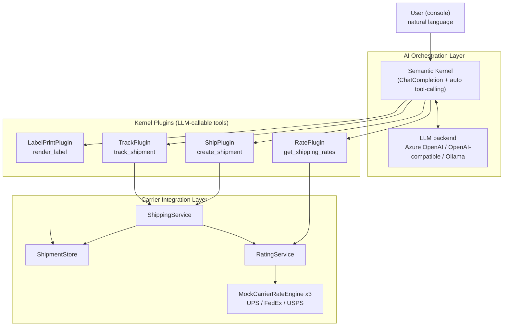
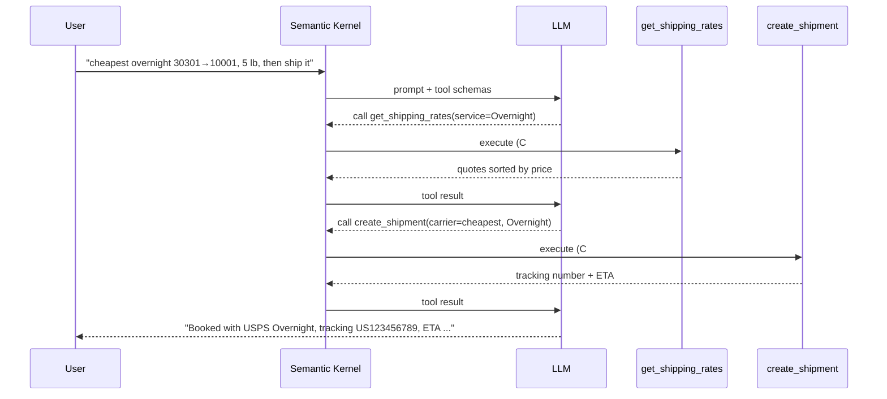

# ShipMate AI — Conversational Multi-Carrier Shipping Copilot

A natural-language shipping assistant built on **.NET 8** and **Microsoft Semantic Kernel**.
Users describe what they want in plain English ("find the cheapest overnight option and
ship it"), and a large language model **autonomously orchestrates** carrier tools — rating,
booking, and tracking — to fulfil the request.

> The AI layer is deliberately decoupled from carrier integration. The LLM handles
> *intent understanding* and *tool orchestration*; the carrier engines do the *real work*
> of rating, shipping, and tracking. Swapping a mock carrier for a live UPS/FedEx/EasyPost
> API requires **no change to the AI layer**.

---

## Highlights

- **LLM Function Calling** — carrier operations are exposed to the model as typed,
  self-describing tools via `[KernelFunction]` + `[Description]` attributes.
- **Multi-step agent orchestration** — a single request can trigger a chain of tool
  calls (rate → ship → track) that the model plans on its own.
- **Cross-tool state** — a tracking number minted by `create_shipment` is resolvable by
  `track_shipment` later in the session.
- **Pluggable LLM backend** — Azure OpenAI, OpenAI, any OpenAI-compatible provider
  (DeepSeek / Qwen / Zhipu), or local **Ollama** — selectable via configuration.
- **Carrier-agnostic abstraction** — `ICarrierRateEngine` mirrors the real
  StarShip `CarrierEngine` rate-transaction dispatch pattern, so production carrier
  integrations drop in cleanly.
- **Secure config** — API keys via .NET user-secrets, never committed to source.

---

## Architecture



### Request flow: "find the cheapest overnight and ship it"



---

## Project layout

```
ShipMate.AI/
├─ ShipMate.AI.slnx
├─ NuGet.config                      # nuget.org only (standalone)
└─ src/ShipMate.AI.Console/
   ├─ Program.cs                      # host: config, kernel, provider switch, chat loop
   ├─ appsettings.json                # Provider + backend settings
   ├─ Carriers/                       # carrier integration layer (mock, swappable)
   │  ├─ ICarrierRateEngine.cs        # rate-engine contract (mirrors CarrierEngine)
   │  ├─ MockCarrierRateEngine.cs     # deterministic stand-in rate engine
   │  ├─ RateModels.cs                # RateRequest / RateQuote / ServiceLevel
   │  ├─ RatingService.cs             # fans rate requests across carriers
   │  ├─ ShipmentModels.cs            # ShipmentRequest / Result / TrackingInfo
   │  ├─ ShipmentStore.cs             # in-memory shipment store (Ship↔Track bridge)
   │  ├─ ShippingService.cs           # create shipment + synthesize tracking
   │  ├─ LabelModels.cs               # LabelFormat / LabelResult
   │  └─ LabelService.cs              # render 4x6 ZPL label from a shipment
   └─ Plugins/                        # Semantic Kernel tools exposed to the LLM
      ├─ RatePlugin.cs                # get_shipping_rates
      ├─ ShipPlugin.cs                # create_shipment
      ├─ TrackPlugin.cs               # track_shipment
      └─ LabelPrintPlugin.cs          # render_label (4x6 ZPL)
```

---

## Tech stack

| Area | Technology |
|---|---|
| Runtime | .NET 8 |
| AI orchestration | Microsoft Semantic Kernel |
| LLM backends | Azure OpenAI · OpenAI · OpenAI-compatible (DeepSeek/Qwen/Zhipu) · Ollama |
| Capability | LLM function calling, multi-step tool orchestration |
| Config / secrets | Microsoft.Extensions.Configuration + user-secrets |

---

## Getting started

### Prerequisites
- .NET 8 SDK (or newer)
- An LLM backend (pick one below)

### Configure an LLM backend

The `Provider` setting selects the backend. Store secrets with user-secrets so keys
never land in source control:

```powershell
cd src/ShipMate.AI.Console
```

**Option A — OpenAI-compatible (e.g. Zhipu GLM, free tier):**
```powershell
dotnet user-secrets set "Provider" "OpenAI"
dotnet user-secrets set "OpenAI:ApiKey"   "<your-key>"
dotnet user-secrets set "OpenAI:ModelId"  "glm-4-flash"
dotnet user-secrets set "OpenAI:Endpoint" "https://open.bigmodel.cn/api/paas/v4"
```

**Option B — Azure OpenAI:**
```powershell
dotnet user-secrets set "Provider" "AzureOpenAI"
dotnet user-secrets set "AzureOpenAI:Endpoint"       "https://<resource>.openai.azure.com/"
dotnet user-secrets set "AzureOpenAI:ApiKey"         "<your-key>"
dotnet user-secrets set "AzureOpenAI:DeploymentName" "gpt-4o"
```

**Option C — Local Ollama (free, offline):**
```powershell
ollama pull qwen2.5      # a model with solid function-calling support
dotnet user-secrets set "Provider" "Ollama"
# defaults: model qwen2.5/llama3.1, endpoint http://localhost:11434/v1
```

### Run

```powershell
dotnet run --project src/ShipMate.AI.Console
```

Then try:

```
Find the cheapest overnight from 30301 to 10001 for a 5 lb residential package, ship it and print the label.
Where is my package?   (use the tracking number returned above)
exit
```

A generated label is written to `bin/.../labels/label_<tracking>.zpl` and can be
previewed in any online ZPL viewer (e.g. Labelary) or sent to a thermal printer.

---

## Notes & limitations

- Carrier data is **mocked** (`MockCarrierRateEngine`) so the AI pipeline runs end-to-end
  with no carrier credentials or cost. The `ICarrierRateEngine` seam is where a real
  integration (UPS/FedEx REST, EasyPost, Shippo) plugs in.
- `ShipmentStore` is **in-memory**, scoped to a single run. Persisting to MongoDB is a
  planned next step.
- Smaller models may occasionally execute only one tool per turn; a brief follow-up
  ("now ship it") nudges the orchestration forward.

## Roadmap

- [ ] Real carrier integration behind `ICarrierRateEngine` (EasyPost / UPS sandbox)
- [x] `LabelPrintPlugin` — generate 4x6 ZPL shipping labels
- [ ] MongoDB persistence for shipments and tracking
- [ ] RAG knowledge base for carrier rules (prohibited items, international eligibility)
- [ ] Minimal API + SignalR streaming front end
- [ ] OpenTelemetry tracing of token usage and tool-call chains
```
